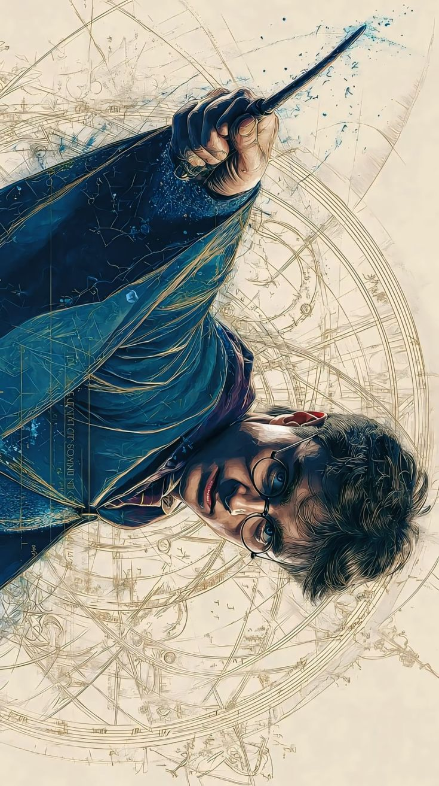

 

  

  

 

| 🧙‍♂️ **Wizard Identity** | 🏰 **House Affiliation** | ⚡ **Current Status** |
| :---: | :---: | :---: |
| Harsh Singh | Gryffindor 🦁 | Brewing Code Potions |

 

**O.W.L. Subjects (Expertise):**  
🛡️ *Defense Against Dark Arts (Cybersecurity)* &nbsp;&nbsp;•&nbsp;&nbsp; 🪄 *Transfiguration (Full-Stack Dev)*  
✨ *Charms (UI/UX Engineering)* &nbsp;&nbsp;•&nbsp;&nbsp; 🧪 *Potions (Backend Architecture)*

  

 

  

 

  

 

  

 

&nbsp;

  

<!-- FOOTER -->

