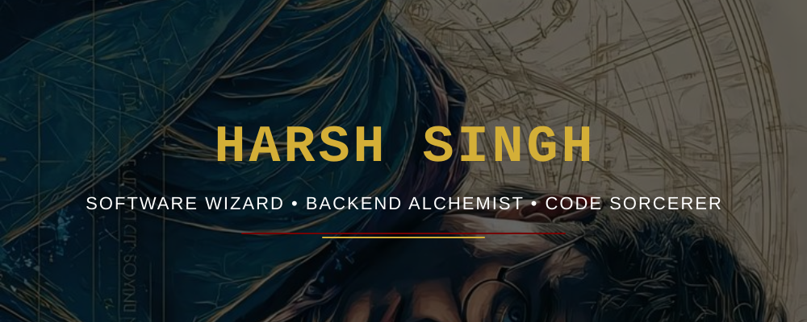

 

  

&nbsp;

&nbsp;

   

<h2>🗺️ THE MARAUDER'S MAP</h2>

  <b> Wizard Identity:</b> Harsh Singh (<i>Gryffindor 🦁</i>)   
  <b> Current Status:</b> Brewing Code Potions (<i>Full-Stack Dev</i>)   
  <b> O.W.L. Expertise:</b>   
  Defense Against Dark Arts (<i>Cybersec</i>) &nbsp;&nbsp;•&nbsp;&nbsp; Potions (<i>Backend APIs</i>) &nbsp;&nbsp;•&nbsp;&nbsp; Transfiguration (<i>React/UI</i>)

  

<h2>📜 MINISTRY OF MAGIC HISTORY (Experience)</h2>

  <b>Data Analyst Intern</b> @ <i>Tata Group (Tata iQ)</i>  
  <i>AI-powered data analysis, predictive modeling & GenAI tools</i>  
  
  <b>Data Science Intern</b> @ <i>British Airways</i>  
  <i>Customer insights, predictive modeling & data visualization</i>  
  
  <b>Cybersecurity Analyst Intern</b> @ <i>TCS</i>  
  <i>Identity & Access Management (IAM), enterprise security protocols</i>

  

<h2> MAGICAL QUESTS (Top Projects)</h2>

  <a href="https://github.com/harshsingh07i"><b>Sahayak AI (EdTech)</b></a> — <i>3rd Rank Winner @ EdTech OnHack</i>  
  <i>AI-powered educational assistant for students & educators.</i>  
  
  <a href="https://github.com/harshsingh07i/AI-FlashCard-FlashGenius"><b>AI FlashCard – FlashGenius</b></a> — <i>Dynamic AI learning app</i>  
  <i>Improves revision efficiency using AI-generated flashcards.</i>  

  <a href="https://github.com/harshsingh07i/Problem-reporting-tool"><b>Problem Reporting Tool</b></a> — <i>Web-based tracking system</i>  
  <i>Structured categorization and issue management.</i>  

  

<h2> MAGICAL STATS</h2>

   

<h2>🔮 ROOM OF REQUIREMENT</h2>

 

  

<!-- FOOTER -->

